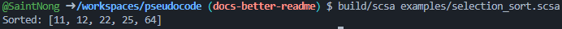
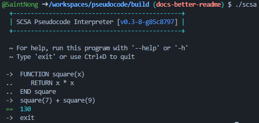
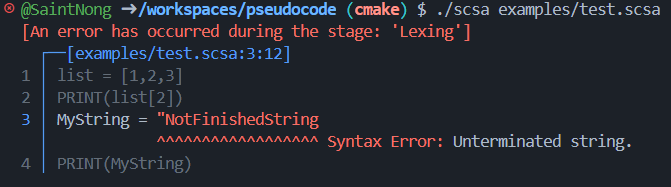

<h1 align="center">SCSA Pseudocode Interpreter</h1>

<p align="center">
    
    
    
    
</p>

<p align="center">
    SCSA Pseudocode is a high-level object oriented interpreted language programming language. <br>
    It is based on the WA School Curriculum and Standards Authority's ATAR Computer Science <a href="https://senior-secondary.scsa.wa.edu.au/__data/assets/pdf_file/0003/1090875/Year-11_12_Computer-Science_ATAR_Additional-syllabus-support-booklet-.PDF">"Pseudocode" (2024)</a>.
</p>

---

> "<em>This spec is so specific that it might as well be a real language...</em>"

This repository contains a full toolchain for Pseudocode development, including an interpreter written in C++, and a [VSCode extension](https://marketplace.visualstudio.com/items?itemName=SaintNong.scsa-pseudocode) with highlighting and snippets.

## Examples

#### Selection Sort in pseudocode (and syntax highlighting)!


#### Integrated command line REPL


#### User friendly error messages!


## Installation

- Follow the [Installation Guide](https://github.com/SaintNong/pseudocode/wiki/Installation-Guide) to get started with the interpreter!

- If you only want Syntax Highlighting/Snippets then check out the [VSCode Extension](https://marketplace.visualstudio.com/items?itemName=SaintNong.scsa-pseudocode) on the marketplace.

## Features
- Handwritten Lexer with locatable tokens
- Recursive descent parser for statements/blocks
- Pratt Parser for parsing expressions with operator precedence
- Working tree walk interpreter
    - Shared pointers for garbage collection
    - Variable scopes
- Native Functions API
- Good error reporting which is anchored to nearest token for easy debugging
- Visual Studio Code Highlighting Extension
- Integration tests
- Circular inheritance check

### Supported Pseudocode Language Features
- Basic datatypes and a dynamic typing system
    - [int, float, string, bool, Null]
    - Functions and instances as variables
- Local/Global scope separation
- Standard Library Functions:
    - `PRINT(...args)`: Prints values followed by a newline.
    - `OUTPUT(...args)`: Prints values without a trailing newline.
    - `INPUT(prompt?)`: Reads a line of input from the user.
    - `INT(value)`: Converts a value to an integer.
    - `FLOAT(value)`: Converts a value to a float.
    - `STRING(value)`: Converts a value to its string representation.
    - `BOOL(value)`: Converts a value to a boolean.
    - `RANDOM(min, max)`: Returns a random integer between min and max.
    - `TIME()`: Returns current system time in seconds.
    - `TYPE(value)`: Returns the type of the value as a string.
- Binary operations/comparisons [+, -, *, /, >, <, >=, <=, ==, !=]
- Logical operators [AND, OR, NOT]
- While, For-In, For-To, and Repeat-Until loops
- If, If-Else and Else-If statements
- Functions
- CASE statements
    - Multiple conditions can be checked by a single branch by separating them with commas
    - Case branches with multi line statements are supported
- Strings
    - `string[i]` Indexes into a string
    - `string.length` Returns the length of a string
    - `string.slice(a, b)` Returns the substring from index a to b (inclusive)
    - Multiplication is supported (0 and negative return empty string)
- Arrays
    - `array[i]` Indexes into an array
    - `array.slice(a, b)` Returns a shallow copy from index a to b (inclusive)
    - `array.append(x)` Appends value to the end of the array
    - `array.length` Returns length of the array as an integer
    - Multiplication is supported (0 and negative return empty array)
- Object Oriented Programming✨✨
    - Syntax requires 'this' to reference object attributes/methods which is technicaly not SCSA standard
    - this.super() is used to call parent constructor/methods/fields (it can be chained)
    - Encapsulation works
    - Object methods work
    - Inheritance works
    - Circular inheritance is checked

## Integration Tests
This project uses a small custom Python test harness integrated with CTest for CI/CD. Tests execute `.scsa` files and check that the interpreter output matches what is expected in the comments. To run the test suite:

1. Build the project ([see installation](https://github.com/SaintNong/pseudocode/wiki/Installation-Guide))
2. Run the tests from the `/tests` directory

```bash
# Runs the integration tests
python3 tester.py <path-to-your-binary>
```

## Environment Variables
The interpreter supports the following environment variables:
- `NO_COLOR`: If set, suppresses all ANSI escape sequences for color output. Follows the [NO_COLOR](https://no-color.org) informal standard.

# Other stuff
## Currently WIP Features
- Dictionary datatype

## Future Plans
- Integrated file IO in standard library
- Subprocess in standard library
- Custom Bytecode VM which requires:
    - Custom stack-based bytecode
    - Bytecode compiler
    - Bytecode virtual machine
    - Some bytecode optimisation
- Manual garbage collector (reference based)

## Credits
- Crafting Interpreters by Robert Nystrom
    - This book is an excellent start to writing interpreters, and was massively helpful for starting this project
- [tombl's scsa-pseudocode](https://github.com/tombl/scsa-pseudocode)
    - In highschool when my friends joked about making an interpreter, to our surprise some legend had already done it before, in Node.js of all languages!
    - This project is excellent, but is based on an older specification of pseudocode without OOP and when variable assignment was done with arrows
