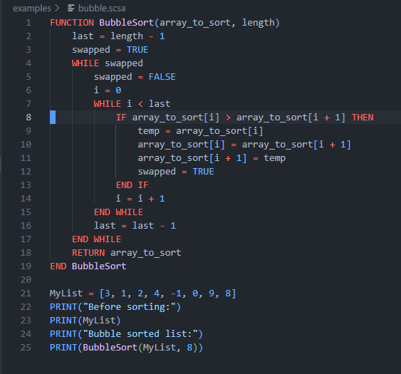

<h1 align="center">SCSA Pseudocode Interpreter</h1>

<p align="center">
    
    
    
</p>

<p align="center">
    Pseudocode is a high-level interpreted language with support for procedural and object oriented programming.
    Based on the WA School Curriculum and Standards Authority's (SCSA) ATAR Computer Science <a href="https://senior-secondary.scsa.wa.edu.au/__data/assets/pdf_file/0003/1090875/Year-11_12_Computer-Science_ATAR_Additional-syllabus-support-booklet-.PDF">"Pseudocode" (2024)</a>.
</p>

---

> "<em>This spec is so specific that it might as well be a real language...</em>"

This repository contains a full toolchain for Pseudocode development, including an interpreter, VSCode extension with highlighting and snippets.

## Examples

### Fully working Bubble Sort in Pseudocode

### Integrated REPL


## Installation

Simply download the [Latest Release](https://github.com/SaintNong/pseudocode/releases/latest) for your selected operating system from here!

#### Requirements

- [Visual Studio Code](https://code.visualstudio.com/download) if you want syntax hightlighting and snippets
- Currently tested operating systems:
    - Ubuntu 24.04
    - Windows 10

> [!TIP]
> It's highly recommended you check that your terminal has ANSI colour support for error messages.

### Installing the Visual Studio Code Extension

To enable syntax highlighting and snippets for the `.scsa` files:
```bash
# You can download the zip file if you do not have git
git clone https://github.com/SaintNong/pseudocode.git
cd pseudocode/vscode
# Package the extension (requires npm)
# You will need to select 'yes' a few times
npx vsce package
# Install vsix file.
code --install-extension *.vsix
```

### Manually compiling the Interpreter

> [!NOTE]
> This part is for people who want to contribute to the project, or have an operating system not already supported by our releases. Manually compiling the interpreter is not a requirement to use it.

The project uses CMake for cross-platform support.

```bash
# Configure the project
cmake -B build -DCMAKE_BUILD_TYPE=Release

# Build the executable
cmake --build build --config Release

# The executable should now be in the 'build' directory
# Linux/macOS: ./build/scsa
# Windows: .\build\scsa.exe
```

## Features
- Handwritten Lexer with locatable tokens
- Recursive descent parser for statements/blocks
- Pratt Parser for parsing expressions with operator precedence
- Working tree walk interpreter
    - Shared pointers for garbage collection
    - Variable scopes
- Good error reporting which is anchored to nearest token for easy debugging
- Visual Studio Code Highlighting Extension
### Supported Pseudocode Language Features
- Basic datatypes and a dynamic typing system
    - [int, float, string, bool, Null]
    - Functions and instances as variables
- Local/Global scope separation
- PRINT library function
- Binary operations/comparisons [+, -, *, /, >, <, >=, <=, ==]
- Logical operators [AND, OR]
- While and For-in loops
- If & If-Else statements
- Functions
- Lists (Append and length is WIP)
- ✨✨Object Oriented Programming✨✨
    - Most features working, but the syntax requires 'this' to reference object attributes/methods
    - No inheritance and polymorphism available as of now

## Requirements
- A C++ compiler with support for C++17
- Terminal with ANSI colour support (Not required but highly recommended)
- Operating systems tested:
    - Ubuntu 24.04
    - Windows 11

## Currently WIP Features
- INPUT
- NOT
- ✨✨Object Oriented Programming✨✨
    - This was a new, painful recent addition to the SCSA pseudocode "standard", when they decided that their ancient Pascal based pseudocode had to be more **"modern"**
    - Polymorphism and inheritance are WIP
- Case statement
- List appending
- ELSE IF statements
- Better string manipulation

## Future Plans
- Unit and integration testing with CI/CD
- Custom Bytecode VM which requires:
    - Custom stack-based bytecode
    - Bytecode compiler
    - Bytecode virtual machine
    - Some bytecode optimisation
- Manual garbage collector (reference based)

## Credits
- Crafting Interpreters by Robert Nystrom
    - This book is an excellent start to writing interpreters, and was massively helpful for starting this project
- [tombl's scsa-pseudocode](https://github.com/tombl/scsa-pseudocode)
    - In highschool when my friends joked about making an interpreter, to our surprise some legend had already done it before, in Node.js of all languages!
    - This project is excellent, but is based on an older specification of pseudocode without OOP and when variable assignment was done with arrows