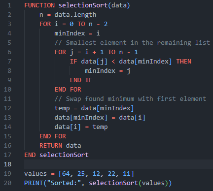
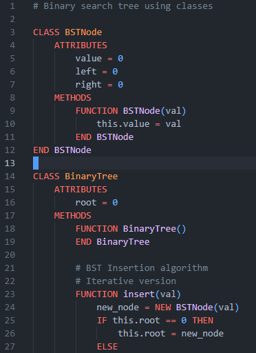

# SCSA Pseudocode

This extension provides syntax highlighting and snippets for **SCSA Pseudocode** (Western Australian ATAR Computer Science's flavour of Pseudocode) in Visual Studio Code. An interpreter is also intended to be used with this extension, to execute and debug your pseudocode.

## Features

- **Syntax Highlighting**: Syntax highlighting according to the SCSA Pseudocode specification (valid as of 2024).
- **Snippets**: Snippets for the control structures (`IF`, `WHILE`, `FOR`, `FUNCTION`, `CLASS`, `CASE`, `REPEAT`).

## Examples

#### Selection sort

#### Part of a binary search tree

> [!NOTE]
> Since SCSA pseudocode has very poor standardisation, many compromises had to be made.
> E.g. OTHER and OTHERWISE are both valid CASE 'default' branches, and both '//' and '#' are valid ways of making comments.

## Pseudocode Interpreter

This extension is designed to be used alongside the comprehensive [SCSA Pseudocode Interpreter](https://github.com/SaintNong/pseudocode).

For the full toolchain, including the C++ interpreter, documentation, and examples, please visit the main repository: **[SaintNong/pseudocode](https://github.com/SaintNong/pseudocode)**

The interpreter should provide correct lexing, parsing, and interpreting of pseudocode verified by many integration tests.

### Current known issues
- The class identifier at the end of each class declaration is currently the same colour as a function rather than class
- Declaring classes which inherit from other classes messes with syntax highlighting for the class and superclass identifier.

## Disclaimer
[View the Legal Disclaimer here](https://github.com/SaintNong/pseudocode#disclaimer)
